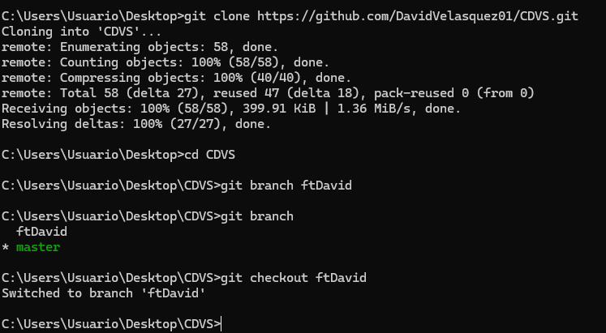

# CVDSRepo1DV
Repo for first CVDS lab

Integrantes 
David Felipe Velasquez Contreras
Santiago Diaz Rojas

Respuestas

David:

Investigacion:

git add sirve para decirle a git que archivos queremos incluir en el seguimiento de git sobre el proyecto actual, si se hace git add . se toman todos los archivos actuales pero tambien se puede solo incluir el nombre de un archivo o una carpeta para solo tomar estos en cuenta.

git commit con el mensaje nos ayuda a guardar los cambios "como tomarle una foto" al codigo en el momento que se hace, con un mensaje para referenciar los cambios hechos, usualmente utilizando una feca

Git init

Creacion del repo y conexion con el local

Ahora vamos a configurar el correo y mi nombre dentro del repositorio.

Parte 2

Santiago me compartio el repositorio de forma normal, ahora intento hacer algun cambio directamente

Como se puede ver da error en los cambios, por lo que hay que manejarlos, manualente los resolvemos haciendo un pull, y luego con ayuda de visual studio resolvemos el merge

Luego visual

Y como podemos ver ya haciendo el merge, quedaron ambos cambios realizados.

Parte 3

Ya clone el repositorio de santiago al que le hice un fork, esta vez en una nueva rama llamada ramaDavid, esta es una mejor manera de resolver conflictos como se puede ver aqui:

Y luego lo clono y creo la nueva rama 

Un pull request se hace asi:

1.Hacer un fork del repositorio que se quiere modificar. Un fork es una copia del repositorio en la propia cuenta de github/gitlab.
2.Clonar el fork a la computadora usando la URL que se obtiene en la página del fork.
3.Crear una rama nueva para hacer los cambios deseados. Se recomienda usar un nombre descriptivo para la rama.
4.Modificar el código fuente y hacer un commit con un mensaje explicativo.
5.Publicar los cambios en el fork usando el comando git push.

Haciendo esto ya se solicito el pull request en github:

