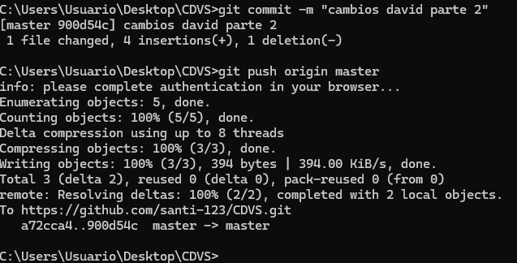
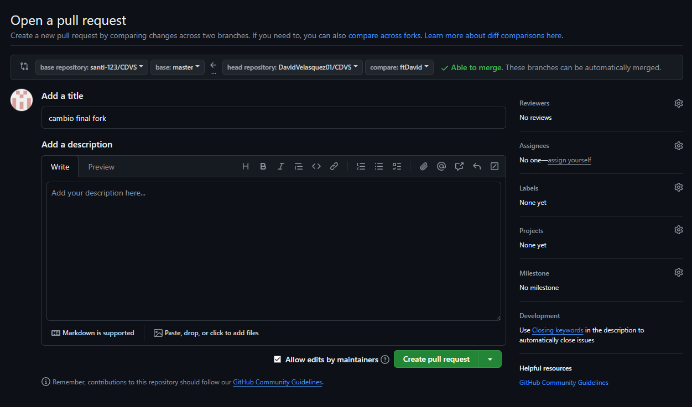

# CVDSRepo1DV

Repo for first CVDS lab

Integrantes
David Felipe Velasquez Contreras
Santiago Diaz Rojas

Respuestas

David:

Parte 1:

Investigacion:

3. Git add sirve para decirle a git que archivos queremos incluir en el seguimiento de git sobre el proyecto actual, si se hace git add . se toman todos los archivos actuales pero tambien se puede solo incluir el nombre de un archivo o una carpeta para solo tomar estos en cuenta.

Git commit con el mensaje nos ayuda a guardar los cambios "como tomarle una foto" al codigo en el momento que se hace, con un mensaje para referenciar los cambios hechos, usualmente utilizando una fecha

Git init

Creacion del repo y conexion con el local

Ahora vamos a configurar el correo y mi nombre dentro del repositorio.

Parte 2:

Inicio aceptando la solicitud de colaboracion de Santiago:

Ahora hicimos un push al mismo tiempo haciendo un cambio previamente en el archivo README, como se puede ver aqui yo gane por lo que es Santiago quien debe resolver los conflictos manualmente:

Luego de que se hayan resuelto los conflictos manualmente volvemos a hacer push al mismo tiempo para esta ves utilizar visual studio code.

Volvi a ganar por lo que ahora Santiago debe resolverlos pero esta vez utilizando la herramienta

Parte 3:

1. Encontramos que una mejor manera de trabajar esto es realizando un fork ya que asi se trabaja una copia del proyecto, esto en proyectos grandes ayuda mucho ya que no se corre peligro de hacer cambios importantes, y cualquiera de estos es posteriormente revisado en un pull request.

2. Un pull request es una solicitud al repositorio original para que se tomen en cuenta los cambios realizados en una copia del proyecto o en una rama alternativa, con ello el administrador decide que cambios se realizan y que cambios no.

Voy a hacer un fork para copiar en un repositorio mio, la parte actual de Santiago

Ya hecho este fork, ahora voy a clonarlo en mi computador, para hacer cambios y posteriormente hacer un pull request.

Primero voy a crear la nueva rama dentro de este:

Ahora dentro de esta rama hago un add, commit y push para que de esta manera los cambios queden guardados en el fork:

Ya los cambios se ven reflejados en github, por lo tanto voy a proceder a hacer el pull request, con esto Santiago debera decidir si aceptar o no los cambios propuestos desde el fork:

Esto es lo que se ve al aceptar el pull request

Seccion de preguntas David Velasquez:

Parte 1:

3. Git add sirve para decirle a git que archivos queremos incluir en el seguimiento de git sobre el proyecto actual, si se hace git add . se toman todos los archivos actuales pero tambien se puede solo incluir el nombre de un archivo o una carpeta para solo tomar estos en cuenta.

Git commit con el mensaje nos ayuda a guardar los cambios "como tomarle una foto" al codigo en el momento que se hace, con un mensaje para referenciar los cambios hechos, usualmente utilizando una fecha

Parte 2:

¿Que sucedio?

Desde mi punto de vista se realizaron los cambios correctamente, sin embargo para Santiago no fue asi por lo que debemos resolver los conflictos.

Ahora hicimos un push al mismo tiempo haciendo un cambio previamente en el archivo README, como se puede ver aqui yo gane por lo que es Santiago quien debe resolver los conflictos manualmente

Parte 3:

1. Encontramos que una mejor manera de trabajar esto es realizando un fork ya que asi se trabaja una copia del proyecto, esto en proyectos grandes ayuda mucho ya que no se corre peligro de hacer cambios importantes, y cualquiera de estos es posteriormente revisado en un pull request.

2. Un pull request es una solicitud al repositorio original para que se tomen en cuenta los cambios realizados en una copia del proyecto o en una rama alternativa, con ello el administrador decide que cambios se realizan y que cambios no.
